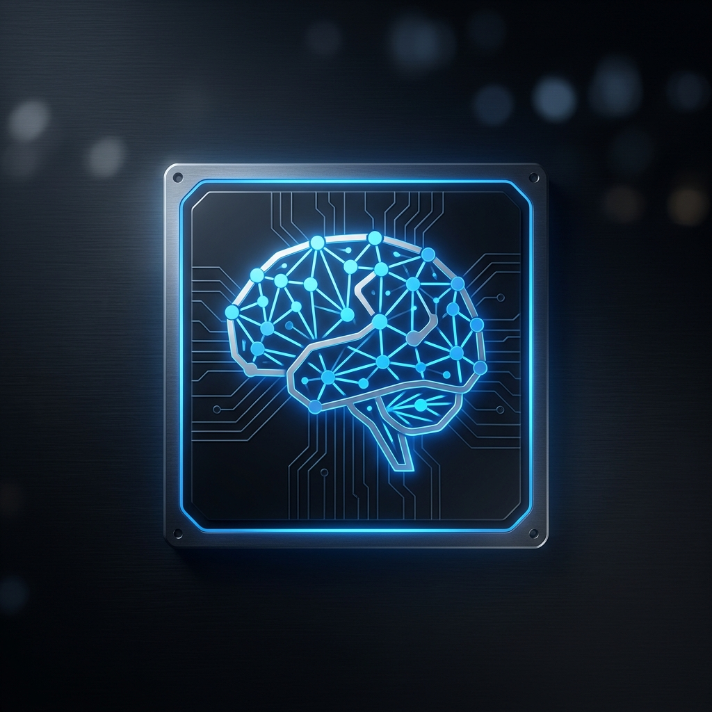

<p align="center">

</p>

<h1 align="center">PureBLM2</h1>

<p align="center">
  <a href="https://github.com/RedLordezh7Venom/baremetallama/issues">
    
  </a>
    <a href="https://github.com/RedLordezh7Venom/baremetallama/blob/main/LICENSE">
  </a>
  <a href="https://github.com/RedLordezh7Venom/baremetallama">
    
  </a>
  <a href="https://discord.gg/your-discord-link">
    
  </a>
</p>

<h3 align="center">
  <a href="PUREBLM2_EVOLUTION.md">Manifesto</a> &bull;
  <a href="#install">Install</a> &bull;
  <a href="#usage">Usage</a> &bull;
  <a href="#vision">The Vision</a>
</h3>

**PureBLM2** is a high-performance **AI Unikernel** designed to run large language models directly on bare metal. By stripping away the traditional operating system, PureBLM2 creates an immutable, RAM-resident environment dedicated to a single task: **Inference.**

---

## 🧐 Description
PureBLM2 is the first "Pure Bare Metal AI Runner." It eliminates the "OS Tax" (the CPU and RAM overhead of background services, desktop environments, and kernel bloat) to provide a zero-latency, air-gapped AI appliance experience.

### Why PureBLM2?
- **Total Privacy**: An immutable system with no networking stack by default. What happens in RAM stays in RAM.
- **Hardware Agnostic**: Boots on everything from 2015-era laptops to modern H100 server clusters.
- **Zero Configuration**: No drivers to install, no Python environments to break. Just plug and play.
- **Ultra-High Density**: 100% of your hardware is dedicated to token generation.
- **Stateless Security**: Every reboot is a factory reset. No persistent OS malware can survive.

---

## 🛠️ Install
PureBLM2 requires a Linux host to build the bootable ISOs.

### Prerequisites
Install the following system tools:
```bash
sudo apt update
sudo apt install grub-common xorriso cpio gzip mtools
```

### Clone the Repository
```bash
git clone https://github.com/RedLordezh7Venom/baremetallama.git
cd baremetallama
```

---

## 🚀 Usage

### 1. Build the AI ISO
Use the Python builder to convert your AI model into a bootable "Neural Drive."
```bash
python3 pureblm2/builder.py qwen2505b.elf -o my_ai.iso
```

### 2. Flash to USB
Identify your USB drive (e.g., `/dev/sdb`) and flash the ISO.
```bash
sudo dd if=my_ai.iso of=/dev/sdb status=progress && sync
```

### 3. Boot the Hardware
Plug the USB into your target laptop or server, disable **Secure Boot** in the BIOS, and boot from the drive. You will reach the AI chat prompt in seconds.

---

## 🌐 The Vision: Pure Bare Metal AI Runner
Beyond personal use, PureBLM2 is built for the next generation of AI data centers.

- **Plug-and-Play Clusters**: Turn a rack of servers into an inference cluster by simply booting them from a PureBLM2 image.
- **Instant Scaling**: Add a new node by plugging in a USB or PXE booting.
- **Immutable Infrastructure**: No local disks to manage, no OS updates to deploy. Update the boot image, and the entire cluster is upgraded on the next reboot.

---

## 📖 Documentation
For a deep dive into how we solved kernel panics, hardware video handover, and the evolution of the project, see the [PUREBLM2_EVOLUTION.md](PUREBLM2_EVOLUTION.md).

## 🤝 Contributors
Open to contributors who want to push the boundaries of bare-metal AI.

---
<p align="center"><i>"AI without the OS Tax."</i></p>