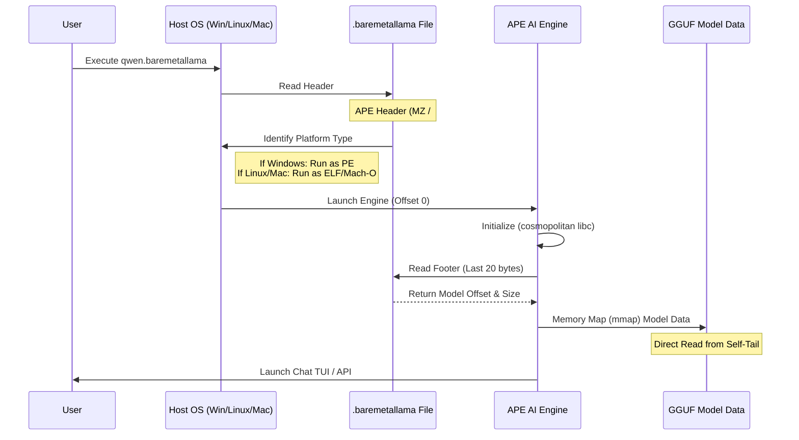
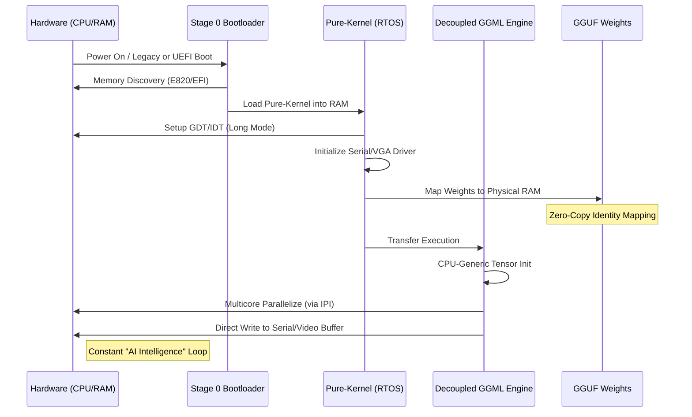

# BareMetalLlama vs PureBLM Algorithms

## 1. .baremetallama Algorithm (OS-Dependent APE)

This diagram shows how the current `.baremetallama` format uses a polyglot header to run across Linux, Windows, and Mac.

---

## 2. .pureblm Algorithm (Bare-Metal RTOS)

This diagram shows the proposed bootable workflow where the AI runs directly on hardware without an OS.

